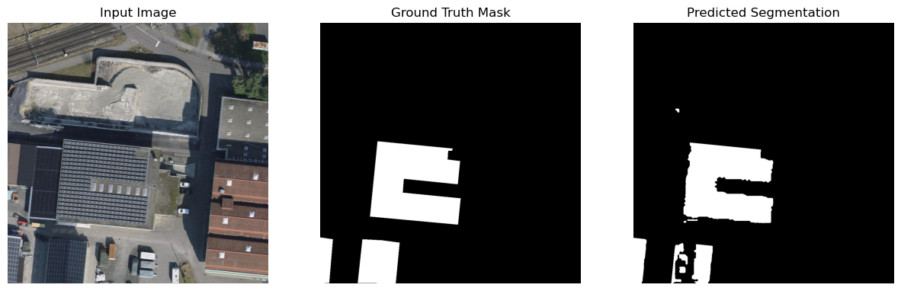

# Solar Panel Segmentation from Aerial Images ☀️
>
> CS-433 | Machine Learning @ EPFL
>
> Mehdi Zoghlami, Maxime Ducourau, Jean Perbet

## Introduction

This repository contains the code for our project within the course CS-433 - Machine Learning @ EPFL. This project was run in partnership with the [Swiss Data Science Center](https://www.datascience.ch), and the goal was to develop a machine learning model to detect solar panels from aerial images provided by [Swisstopo](https://www.swisstopo.admin.ch/de).

This project experiments with both [U-Net](https://en.wikipedia.org/wiki/U-Net) and [DeepLabv3](https://pytorch.org/hub/pytorch_vision_deeplabv3_resnet101/) architectures, using CNNs for the binary semantic segmentation task of deciding whether a pixel is a solar panel or not on aerial images. Feel free to check the [demo](https://huggingface.co/spaces/jeanprbt/swiss-solar-panels-segmentation) of our best results on Hugging Face Spaces!



## Repository structure

The repository is structured as follows:


```foo
├── data/                           
│   ├── images/              # Images
│   ├── labels/              # Ground truth labels
│   ├── roofs/                        
│   │   ├── coordinates/     # Coordinates of all swiss roofs
│   │   ├── images/          # Images w/ filtered out roofs
│   │   └── masks/           # Binary masks of roofs corresponding to images
│   ├── tiles/               # Original tiles             
│   ├── urls/                # Swisstopo URLs  
│   └── weights/             # Pre-trained weights for models
├── notebooks/
│   ├── preprocessing.ipynb  # Notebook for data retrieval & preprocessing
│   └── results.ipynb        # Main notebook w/ results
├── report.pdf               # Associated paper
├── src/
│   ├── models/              # Model-specific classes/functions    
│   ├── dataset.py           # Data loading classes/functions
│   ├── model_functions.py   # Generic model functions
│   ├── plotting.py          # Plotting functions
│   ├── postprocessing.py    # Postprocessing functions
│   └── preprocessing.py     # Preprocessing functions
├── assets/
│   └── example.png          # Assets for documentation
└── README.md
```

## Run instructions
In case you want to run the code, please follow these next steps.

1. Install the required dependencies.

    ```sh
    pip install -r requirements.txt
    ```

2. Data should be collected and put in the corresponding directories. There are two ways to do this.
    - Run the `preprocessing.ipynb` notebook in the `notebooks/` directory (~500 data points)
    - Directly download the data from this [kaggle dataset](https://www.kaggle.com/datasets/jeanprbt/swiss-solar-panels-segmentation/data?select=images) (~750 data points)

3. Decide whether you want to train models on your own or use them pre-trained with the weights we provide. In the latter case, you should download the weights from the same [kaggle dataset](https://www.kaggle.com/datasets/jeanprbt/swiss-solar-panels-segmentation/data?select=images) as for the previous step.

4. Run the main notebook `results.ipynb` with training & results parts.
